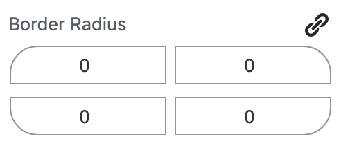

# Border Radius

Allows to control border radius separately for each side.

## Look




## Usage

```
import { BorderRadius } from '../../control/border-radius';

<BorderRadius borderRadius={ borderRadius } onChange={ this.onChange } />
```

### Attribute { border }

```
borderRadius: {
	type: 'object',
	default: { topLeft: 0, topRight: 0, bottomRight: 0, bottomLeft: 0 },
},
```

### Callback { onChange }

```
onChange( value, corner, linked ) {
	const { setAttributes } = this.props;
	const { borderRadius } = this.props.attributes;

	if ( linked ) {
		const newBorderRadius = {
			topLeft: parseInt( value, 10 ),
			topRight: parseInt( value, 10 ),
			bottomRight: parseInt( value, 10 ),
			bottomLeft: parseInt( value, 10 ),
		};
		setAttributes( { borderRadius: newBorderRadius } );
	} else {
		setAttributes( { borderRadius: { ...borderRadius, [ corner ]: parseInt( value, 10 ) } } );
	}
}
```

## Utility: borderRadiusCalculateStyle()
The control provides a utility function to calculate the style based on the used sides.
It never produces more styles than necessary, so if the control is linked it will just created `border-radius: ...` and
for unlinked border-radius it will just generate styles for the used sides.

### Usage example 
```
// edit.js / save.js
import { borderRadiusCalculateStyle } from '../../control/border-radius';

...

<div style={ borderRadiusCalculateStyle( borderRadius ) }>

</div> 
```
