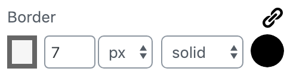
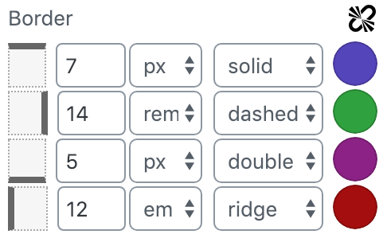

# Border

Allows to control border width, style and color separately for each side.

## Look

Linked:



Unlinked:



## Usage

```
import { Border } from '../../../control/border';

<Border border={ border } onChange={ this.onChange } />
```

### Attribute { border }

```
const DEFAULT_BORDER = {
	style: 'solid',
	width: null,
	widthUnit: 'px',
	color: { hex: '#000000', rgb: { r: 0, g: 0, b: 0, a: 1 } },
};

...

border: {
	type: 'object',
	default: {
		top: DEFAULT_BORDER,
		right: DEFAULT_BORDER,
		bottom: DEFAULT_BORDER,
		left: DEFAULT_BORDER,
	},
},
```

### Callback { onChange }

```
onChange( border ) {
	this.props.setAttributes( { border } );
}
```

## Utility: borderCalculateStyle()
The control provides a utility function to calculate the style based on the used sides.
It never produces more styles than necessary, so if the control is linked it will just created `border: ...` and
for unlinked border it will just generate styles for the used sides.

### Usage example 
```
// edit.js / save.js
import { borderCalculateStyle } from '../../control/border'

...

<div style={ borderCalculateStyle( this.props.attributes.border ) }>

</div> 
```
