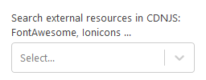

# CND Loader control

Allows load resources using [CDNJS API](https://cdnjs.com/api)



## How it works

- A `react-select` control allows user to find resources using CDN API

## How to use it

```html
<CdnLoader
	label={ label }
	onSelectChange={ item => setAttributes( { resource: item } ) }
	isCSS
	isJS
/>
```

### Properties

- **label**: Label displayed
- **onSelectChange**: callback called when a resource is selected. It returns an object:
```javascript
{
	label: 'Label',
	value: 'http://....',
}
```
- **isCSS**: filters the URLs by CSS
- **isJS**: filters the URLs by JS

