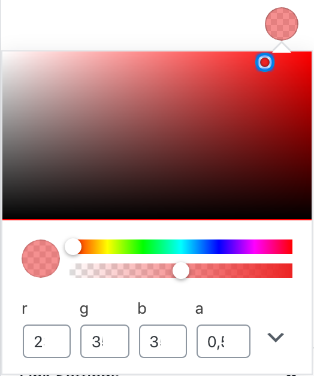

# ColorPicker

Currently it only supports one format: Circle of the selected color which offers settings in a dropdown (onclick).

Example with active dropdown:



```html
<ColorPicker color={ { hex: '#000000', rgb: { r: 0, g: 0, b: 0, a: 1 } } } onChange={ func(color) } />
```
