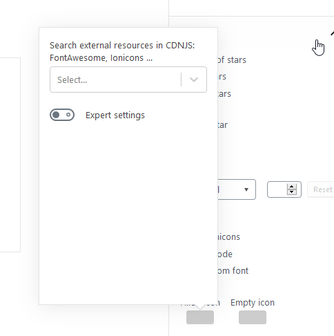

# Icon Selector control

Allows blocks to add an icon in their settings. Icons are loaded form Dashicons, Font-Awesome or Ionicons



## How it works

- Select an icon font
- CSS file is included using a `<link>` tag
- CSS is parsed looking for rules that contain unicode code points
- CSS URL is stored
- Font family name is stored
- A list of icons is loaded
- When clicking an icon, font code point is stored

## How to use it

```javascript
<IconSelector
	label={ __( 'Filled icon', 'toolset-block' ) }
	cssFontURL={ customFontURL }
	fontCode={ customFontFilledCode }
	fontFamily={ customFontFamilyName }
	onChangeCssURL={ value => setAttributes( { customFontURL: value } ) }
	onChangeFontCode={ value => setAttributes( { customFontFilledCode: value } ) }
	onChangeFontFamily={ value => setAttributes( { customFontFamilyName: value } ) }
/>
```

### Properties

- **label**: Label displayed
- **cssFontURL**: CSS File url: `https://cdnjs.cloudflare.com/ajax/libs/font-awesome/4.7.0/css/font-awesome.min.css`
- **fontCode**: unicode code point: `\f01a`
- **fontFamily**: `font-family` value: `FontAwesome`
- **onChangeCssURL**: callback called when `cssFontURL` changes
- **onChangeFontCode**: callback called when `customFontFilledCode` changes
- **onChangeFontFamily**: callback called when `customFontFamilyName` changes

## Important notes

After loading the editing page, the CSS file is not loaded until the control is loaded. The problem is that the control usually loads when user clicks in the block and `<InspectorControls>` is displayed. So CSS file must be included also block `componentDidUpdate()` method:

```javascript
import { loadCustomCSS } from '../../control/icon-selector/externalCss';

...

componentDidUpdate() {
	if ( this.props.attributes.customFontURL ) {
		loadCustomCSS( this.props.attributes.customFontURL );
	}
}
```
