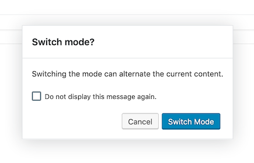

# Dialog

This dialog is based on the Modal of WordPress. The big difference is that it's not a Component by itself.

**Update 2.0**
The dialog can now also be used directly as Component:

```javascript
import { DialogModal } from '../utils';

...

render() {
    return <DialogModal dialogId='my-unique-id'>Content of the Dialog</DialogModal>
}
```
**Usage Example** not as Component
```javascript
import { dialog } from '../utils';

dialog( {
    dialogId: 'my-unique-dialog-id',
    title: __( 'Switch mode?', 'wpv-views' ),
    buttons: [
        {
            label: __( 'Cancel', 'wpv-views' ),
            onClick: () => null,
        },
        {
            label: __( 'Switch Mode', 'wpv-views' ),
            onClick: switchEditorMode,
            isPrimary: true,
        },
    ],
    isDismissable: false,
    isDisableable: true,
    content: () => {
        return (
            <Fragment>
                <p>
                    { __( 'Switching the mode can alternate the current content.', 'wpv-views' ) }
                </p>
            </Fragment>
        );
    },
} );
```
When using `isDisableable = true` this can be used to read the disabled status:

```javascript
withSelect(
    ( select ) => {
        const { isDialogEnabled } = select( 'toolset/dialogs' );
        return {
            myDialogIsDisabled: ! isDialogEnabled( 'my-unique-dialog-id' ),
        };
    }
)
```


**Will show:**  


# Params
#### {string} dialogId
- Internally used for adding/selecting the dialog on the DOM.
- Required to read the disabled status from the store.

#### {string} title

#### {array} buttons
- {string} label
- {callable} onClick (can be null, which will only close the dialog onClick)
- {boolean} isPrimary true = blue
- Buttons are rendered from left to right.

#### {boolean} isDismissable
- true: will display the X top right on the dialog and also enables "ESC" to close the dialog.
- false: no X and no "ESC" function. The user has to click on a button.

#### {boolean} isDisableable
- true: will show a checkbox to not show the dialog in the future.
- false: no checkbox

**Note:** there's currently no option to change the message. Did not more here than I needed. Feel free to add. :)

#### {callable} content
- Returns the content of the dialog.
