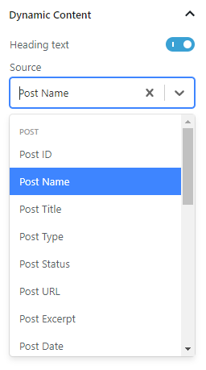
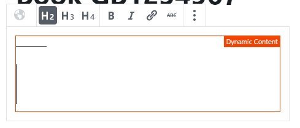

# Dynamic Sources control
Allows blocks to handle content coming from dynamic sources, e.g. Post title, custom fields, site data etc. 



## How it works
In order for a block to support content coming from dynamic sources, it needs to use two basic components:
- The **EditWrapper** component
- The **DynamicPanel** component

## **EditWrapper** component


This component is responsible for handling the interaction of the block with the editor, related to content coming from 
dynamic sources.
This component does two things:
- Renders this orange border around the block to signify that the block uses content from Dynamic sources.
- Renders a spinner and a loading message whenever the `DynamicPanel` components fetches the content for the selected 
Dynamic Source from the REST API.

It should receive the following attributes:
- **clientId**, coming from `props.clientId` and basically is the ID of blocks assigned by the editor.
- **isSelected**, coming from `props.isSelected` and basically is the `isSelected` attributes of the block set directly by 
 the editor whenever the block is selected.
- **hasDynamicSource** is a boolean attributes which basically is the condition according to which the block is signified
as one using content from dynamic source or not. For example, if the block only has one attribute that is eligible for 
content from dynamic sources, the value of the `hasDynamicSource` should be set to true whenever the user selects to enable 
dynamic sources for this attribute.

### How to use it
In order to use this component, enclose the `edit` component of the block inside this component. For a clearer example,
please see the implementation of the `Heading` block.

## **DynamicPanel** component


This component is the most complex part of the equation. It does the following:
- Renders the UI that will fit into the Inspector sidebar of each block that uses it. This UI includes controls to enable 
content from dynamic sources for a block attribute as well as controls to select sources and sources' fields for this dynamic
content to come from.
- Handles all the REST API requests related to fetching the content from dynamic sources.

It should receive the following attributes:
- **isSelected**, coming from `props.isSelected` and basically is the `isSelected` attributes of the block set directly by 
   the editor whenever the block is selected.
- **dynamicSourcesEligibleAttributes** is an object the contains information and callbacks for all the block's attributes 
that are eligible for content from dynamic sources. A detailed description of this object follows.

### How to use it

In order to use this component, it should be included as a child component of the `InspectorControls` part of the `edit` 
component of the block. For a clearer example, please see the implementation of the `Heading` block.

### **dynamicSourcesEligibleAttributes**
The object's structure is the following:

```
dynamicSourcesEligibleAttributes = {
	attr1: {
		label,
		sourceObject,
		fieldObject,
		condition,
		toggleChangedCallback,
		selectSourceChangedCallback,
		selectFieldChangedCallback,
		sourceContentFetchedCallback,
		category
	},
	attr2: {
		...
	}
}
```
The object should contain one property for each of its attributes that are eligible for content from dynamic sources (`attr1`, 
`attr2`...). The value of such property should be an object containing ALL of the following properties:
- **label** is the text that will appear next to the toggle, as depicted in the image above ("Heading text").
- **sourceObject** is the object responsible to hold the value of the dynamic source Select control. It's an object of type 
`{ label: 'Post title', value: 'post-title' }`. The value for this property should be an object attribute provided by the 
block's attributes.
- **fieldObject** is the object responsible to hold the value of the dynamic source field Select control (not depicted in 
the image above). It's an object of type `{ label: 'Post title', value: 'post-title' }`. The value for this property should 
be an object attribute provided by the block's attributes.
- **condition** is a boolean value. Usually this is the save as the `hasDynamicSource` attribute of the `EditWrapper` component.
- **toggleChangedCallback** is a method that will be triggered whenever the toggle button to enable content from dynamic sources 
for a property is toggled. In this callback, the block will most probably want to toggle the attribute assigned to the `condition`
property of this component.
- **selectSourceChangedCallback** is a method that will be triggered whenever a new or no source has been selected in the 
relevant Select control. In this callback, the block will most probably want to save the value of the Select control in 
the object used for the `sourceObject` property of this component.
- **selectFieldChangedCallback** is a method that will be triggered whenever a new or no source field has been selected in the 
relevant Select control. In this callback, the block will most probably want to save the value of the Select control in 
the object used for the `fieldObject` property of this component.
- **sourceContentFetchedCallback** is a method that will be triggered whenever content has been fetched for the selected source.
In this callback, the block will most probably want to handle the dynamic content accordingly to reflect the change on the block
preview on the editor.
- **category** is a property that defines the kind of sources that this attribute could accept content from, e.g. text, number etc.
