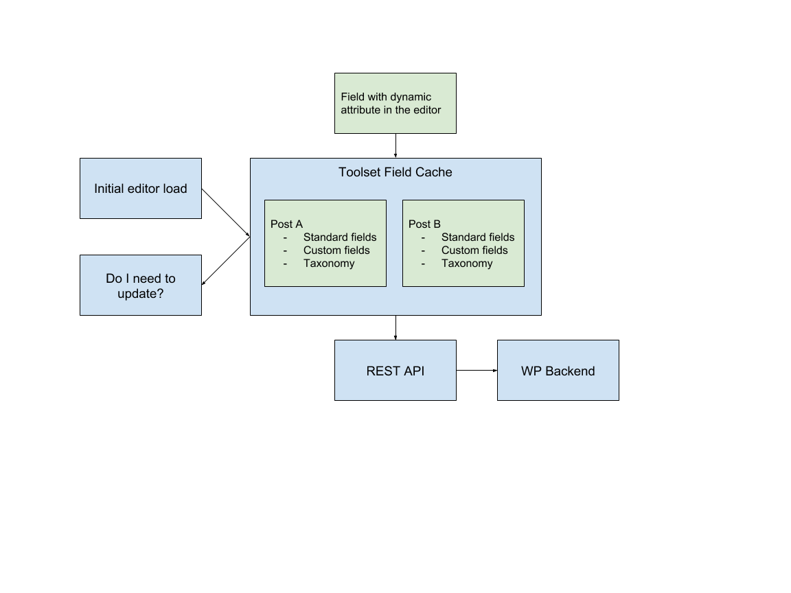

# Dynamic Sources Caching Mechanism
Allows caching of content from dynamic source to prevent time-consuming REST API requests and also implements a polling 
mechanism to invalidate and update the cache at a predefined interval.



## How it works
This caching mechanism intercepts all the call made from blocks to fetch content from dynamic sources and before allowing
them to make REST API request to fetch the dynamic content, it first checks whether the requested data are available in the
cache. If the data are available, the caching mechanism returns them instantly to the block, otherwise it allows the execution
of the relevant REST API request.

On editor load the server-side part of the mechanism prepares the object to be cached and makes it available to all the 
blocks of the editor through `wp_localize_script`.

When the editor is fully loaded and a block supporting content from dynamic sources is mounted, it tries to fetch the
updated content. Again, if the relevant data exist in the cache, they are instantly returned to the block, while if not
available a REST API request is made to update the block's content.

At the same time, the block needs to hook an action to the `tb.dynamicSources.actions.cache.updated` hook, under the `toolset-blocks` in order
to be updated each time the polling part of the caching mechanism detects that the cache should be invalidated. The hooking 
should look like:

```
wp.hooks.addAction(
	tb.dynamicSources.actions.cache.updated',
	'toolset-blocks',
	updateBlockContentFromCache
);
```

At a predefined interval, the caching mechanism polls the server, practically asking it to rebuild the cache and respond 
to the poll with the latest version of the cached object. Then on the client side the mechanism compares the two instances
of the cache and decides if the stored cache needs to be invalidated. If this is the case, the mechanism updates the cache
and triggers an action on order to propagate this change to the blocks that need to be updated, otherwise it discards the
fetched cached object and continues normal execution.

## Example

For an example of the above described, please see the [Edit component of the Heading block](/public_src/block/heading/Edit.js).
